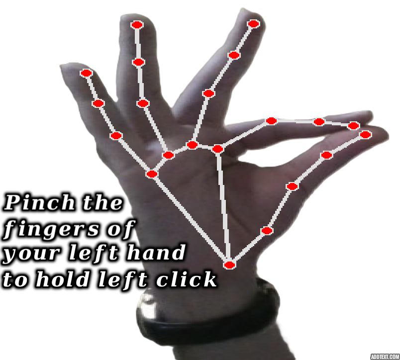
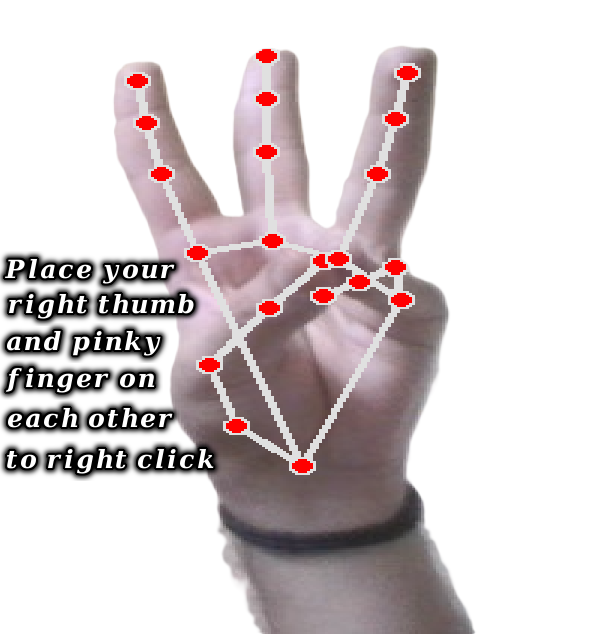
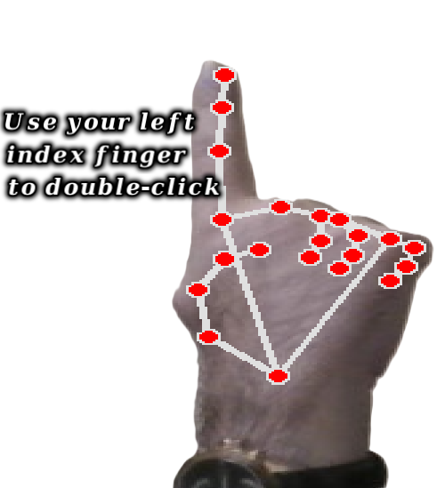
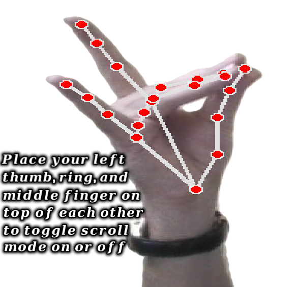
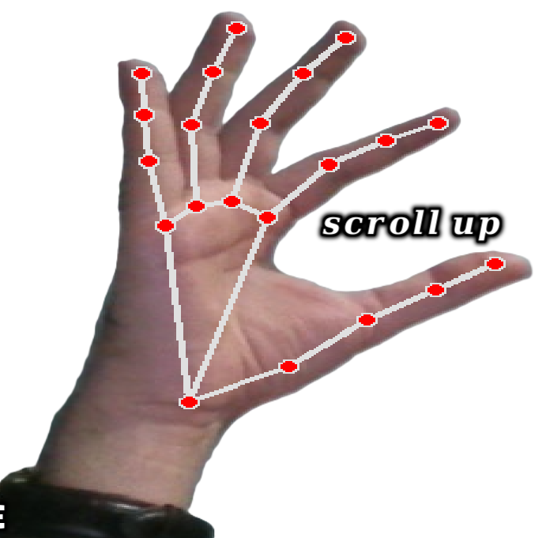
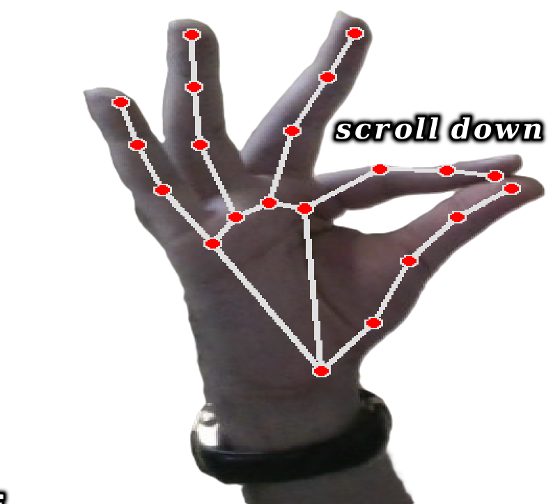
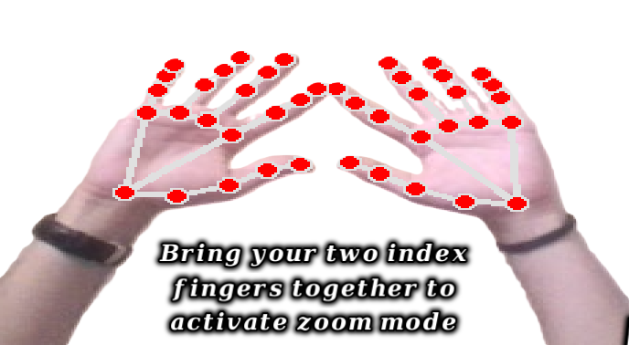
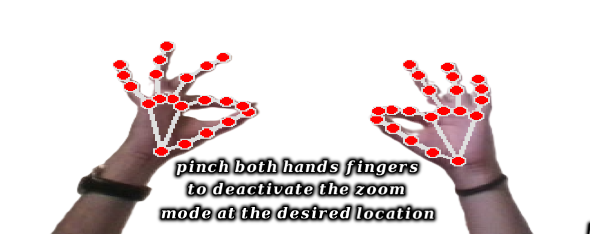

# Sight-Pad

**Sight-Pad** is a webcam-based hand-gesture interaction system designed to control common desktop pointing, clicking, scrolling, and zooming actions without relying on a physical touchpad.

The project uses **MediaPipe** for real-time hand landmark tracking and **PyAutoGUI** for computer interaction. Its gesture logic is implemented through geometric relationships between tracked hand landmarks, combined with timing, thresholds, cooldowns, and interaction states.

> **Project scope:** The original implementation source code is intentionally **not included in this public repository**. This repository presents the project's concept, technical architecture, interaction design, demonstrated capabilities, and engineering considerations without publishing the original implementation.

---

## Table of Contents

- [Overview](#overview)
  - [Core Capabilities](#core-capabilities)
- [Project Demonstration](#project-demonstration)
- [System Architecture](#system-architecture)
  - [1. Webcam Input](#1-webcam-input)
  - [2. Hand Tracking](#2-hand-tracking)
  - [3. Geometric Gesture Analysis](#3-geometric-gesture-analysis)
  - [4. Desktop Interaction](#4-desktop-interaction)
- [Gesture-to-Action Mapping](#gesture-to-action-mapping)
- [Demonstrated Interactions](#demonstrated-interactions)
  - [Left Click](#left-click)
  - [Right Click](#right-click)
  - [Double Click](#double-click)
  - [Scroll Mode](#scroll-mode)
  - [Scroll Up](#scroll-up)
  - [Scroll Down](#scroll-down)
  - [Start Zooming](#start-zooming)
  - [Stop Zooming](#stop-zooming)
- [Interaction Design](#interaction-design)
- [Performance-Oriented Design](#performance-oriented-design)
- [Interaction Parameters](#interaction-parameters)
- [Technical Stack](#technical-stack)
- [Limitations](#limitations)
- [Future Development](#future-development)
- [Repository Structure](#repository-structure)
- [License](#license)
- [Project Context](#project-context)

---

## Overview

Sight-Pad explores touchless human-computer interaction through hand tracking.

At a high level, the system follows this pipeline:

**Webcam Input → Hand Landmark Detection → Geometric Gesture Analysis → Interaction State → Desktop Action**

The original implementation tracks up to two hands and maps selected hand configurations to mouse and zoom operations.

### Core capabilities

- Cursor movement
- Left click
- Right click
- Double click
- Scroll-mode activation
- Scroll up / down
- Two-hand zoom control

---

## Project Demonstration

A video demonstration of Sight-Pad is available on LinkedIn:

[Watch the project demonstration on LinkedIn](https://www.linkedin.com/posts/kianshojaei_mediapipe-opencv-activity-7245463781684723713-Vow7)

---

## System Architecture

### 1. Webcam Input

The system captures live video from a webcam using OpenCV.

The original implementation configures the camera at **640 × 480** resolution and samples frames periodically rather than processing every captured frame.

### 2. Hand Tracking

**MediaPipe Hands** is used to detect hand landmarks in real time, with support for up to two hands.

The detected landmarks provide normalized coordinates for the fingers and other hand joints. These coordinates form the basis for the gesture analysis stage.

### 3. Geometric Gesture Analysis

Rather than relying on a trained gesture-classification model, the original implementation determines interactions from distances and spatial relationships between selected landmarks.

Examples include:

- Index fingertip ↔ thumb distance
- Thumb ↔ pinky distance
- Thumb ↔ middle/ring finger distances
- Distance between the two index fingertips
- Relative positions of multiple fingers

### 4. Desktop Interaction

Detected interactions are translated into operating-system mouse and keyboard actions through **PyAutoGUI**.

Cursor movement is handled separately from several gesture-triggered actions, and the original implementation uses threaded cursor updates as part of its interaction design.

---

## Gesture-to-Action Mapping

| Interaction | Hand configuration / condition | Result |
|---|---|---|
| Cursor movement | Right-hand index fingertip tracking | Move mouse cursor |
| Left click | Left-hand index-thumb pinch | Left mouse button |
| Right click | Right-hand thumb-pinky proximity | Right mouse button |
| Double click | Left-hand index fingertip | Double click |
| Scroll mode | Left-hand thumb-middle and thumb-ring proximity | Toggle scrolling |
| Scroll | Left-hand index-thumb distance while scroll mode is active | Scroll up / down |
| Start zooming | Both index fingertips brought close together | Enter zoom mode |
| Stop zooming | Both hands satisfy the zoom-release condition | Exit zoom mode |
| Zoom | Change in distance between the two index fingertips | Zoom in / out |

The exact thresholds and timing rules are implementation-specific and were designed to reduce unintended repeated actions.

---

## Demonstrated Interactions

The repository includes visual demonstrations of the project's interaction vocabulary.

### Left Click



Demonstrates the left-click interaction.

### Right Click



Demonstrates the right-click interaction.

### Double Click



Demonstrates the double-click interaction.

### Scroll Mode



Demonstrates activation of the scrolling interaction mode.

### Scroll Up



Demonstrates the scroll-up interaction.

### Scroll Down



Demonstrates the scroll-down interaction.

### Start Zooming



Demonstrates entering the two-hand zoom interaction.

### Stop Zooming



Demonstrates the zoom-release interaction.

---

## Interaction Design

Sight-Pad is structured around several persistent interaction variables and timing constraints rather than treating every detected frame as an independent command.

Important design elements include:

- **Press/release thresholds** for click detection
- **Cooldown periods** to reduce repeated triggering
- **Scroll-mode state** to separate scrolling from other left-hand interactions
- **Zoom-mode state** for two-hand zoom interactions
- **Frame sampling** to reduce processing frequency
- **Threaded cursor movement** to keep pointer updates responsive

This state-oriented approach is particularly relevant to touchless interfaces, where small landmark fluctuations can otherwise result in unintended system actions.

---

## Performance-Oriented Design

The original implementation includes several mechanisms intended to balance responsiveness and computational cost:

| Mechanism | Role |
|---|---|
| 640 × 480 webcam input | Limits the amount of image data processed |
| Frame sampling | Processes every third frame |
| MediaPipe Hands | Provides real-time landmark tracking |
| Threaded cursor movement | Separates cursor updates from the main interaction flow |
| Cooldown timers | Reduce repeated gesture activation |

These choices reflect an emphasis on real-time interaction rather than offline gesture analysis.

---

## Interaction Parameters

The original implementation contains several configurable parameters controlling gesture behavior:

| Parameter | Purpose |
|---|---|
| click_threshold | Distance threshold for click activation |
| release_threshold | Distance threshold for releasing a click |
| scroll_threshold | Threshold used by the scrolling interaction |
| zoom_threshold | Threshold associated with zoom activation/deactivation |
| cooldown_period | Minimum time between selected repeated interactions |
| double_click_freeze_time | Prevents repeated double-click activation |
| zoom_scale_factor | Declared zoom-related configuration parameter in the original implementation |

The exact values belong to the private implementation and are therefore not reproduced here.

---

## Technical Stack

| Technology | Role |
|---|---|
| Python | Core implementation language |
| OpenCV | Webcam capture and frame processing |
| MediaPipe | Hand landmark detection |
| PyAutoGUI | Desktop mouse/keyboard interaction |
| NumPy | Geometric distance calculations |
| Threading | Asynchronous cursor movement |

---

## Limitations

The original implementation has several practical limitations:

- Hand tracking can be affected by lighting and camera conditions.
- Touchless interaction depends on maintaining sufficiently clear hand visibility.
- Gesture thresholds may require adjustment for different users, cameras, or environments.
- System-level mouse and keyboard actions introduce platform/application-specific behavior.

---

## Future Development

Potential directions for extending the project include:

- More robust gesture classification
- User-configurable gesture thresholds
- Additional desktop interactions
- Improved handling of landmark noise and ambiguous gestures
- Adaptive calibration for different users and camera setups
- Expanded interaction vocabulary for accessibility-oriented applications
- Evaluation across a broader range of environments and users

---

## Repository Structure

```
Sight-Pad/
├── Images/
│   ├── double-click.png
│   ├── left-click.png
│   ├── right-click.png
│   ├── scroll-down.png
│   ├── scroll-mode.png
│   ├── scroll-up.png
│   ├── start-zooming.png
│   └── stop-zooming.png
├── LICENSE
└── README.md
```

The repository intentionally contains documentation and interaction demonstrations rather than the original source implementation.

---

## License

This project is licensed under the **MIT License**. See [LICENSE](LICENSE) for the full license text.

---

## Project Context

Sight-Pad is part of a broader exploration of **Computer Vision, Human-Computer Interaction, and real-time gesture-based interfaces**.

The project focuses on translating visual hand information into practical desktop interactions and serves as an applied example of landmark-based gesture interaction.
